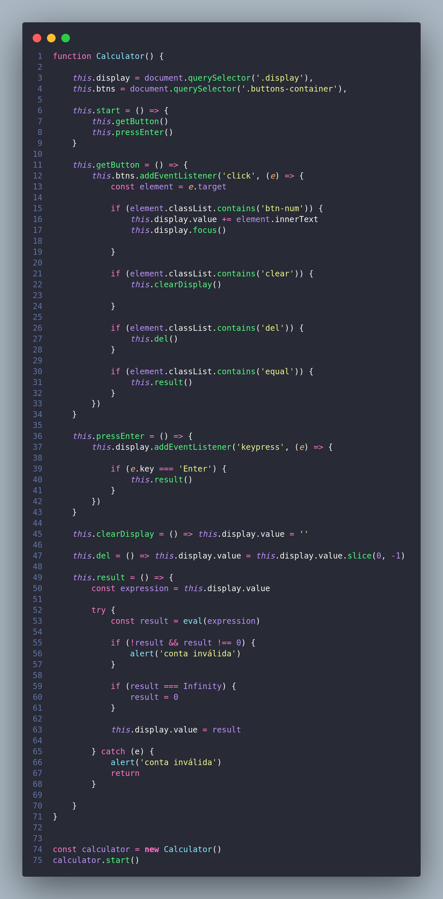

# Calculadora (refatorado para Constructor function)

- Exercício para treinar o conceito de **Constructor Function** e do **this**
- Onde desenvolvi essa calculadora com o conceito de uma função que retorna um objeto com os atributos e métodos de conta da calculadora.

## O que aprendi?

- Melhorei meu entendimento sobre objetos Js, em que podemos declarar métodos dentro do objeto e acessa-los como se fossem atributos.
- Que com o comando **this** eu consigo referênciar o objeto que esta chamando, podendo assim utilizar os próprios atritutos dentros dos métodos, sem ter que criar novas variáveis.
- Utilizei bastante addEventListener para poder pegar as interações com a calculadora e identificar onde o usuário esta clicando.

## Resultado

## Código

